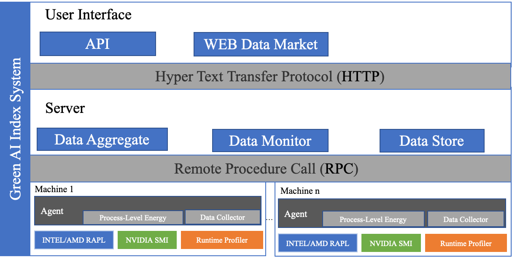

# Automatic AI Model Greenness Track Toolkit

___

## 背景

___
Automatic AI Model Greenness Track Toolkit是整合蚂蚁绿色计算项目中的一个子项目，其主要目的为打造通用、开放的AI模型绿色度衡量工具。Automatic AI Model Greenness Track Toolkit以算力、能耗、碳排放三个绿色度指标评估AI算法对于环境的友好程度，可以有效的协助AI开发者发现或优化模型。

## 功能特性
Automatic AI Model Greenness Track Toolkit能够通过几行代码注入，快速准确的采集能耗和算力。

采集工具的整体架构上图所示。所有模块都基于绿色人工智能指数系统，可以分为以下三个层次：

第一层是Agent，主要用于连接用户计算机的硬件接口，获取元数据，进行初步处理（包括数据拆分和二氧化碳转换），同时将处理后的数据存储在用户的本地文件系统中，供用户后续查看和报告核心系统使用。

第二层是核心系统（Server）。在这一层中，Agent采集的数据将根据用户的实验维度进行收集和聚合，并由服务器提供数据存储和数据监控服务。同时，服务器端将收集用户的所有计算节点中的Agent，以确保用户整个实验的绿色数据的完整性。

第三层是用户界面。这一层主要为用户提供视觉交互界面和数据服务接口。用户可以根据自己的需求启动服务器来可视化绿色数据，并可以通过开放接口对绿色数据进行二次开发。
### 能耗

Automatic AI Model Greenness Track Toolkit支持以下硬件的能耗采集:

- Intel CPUs
- AMD CPUs
- NVIDIA GPUs

### 算力

Automatic AI Model Greenness Track Toolkit支持以下深度学习框架的算力采集:

- TensorFlow
    - 1.x版本

## 安装

___

pip install -r requirement.txt
python setup.py build
python setup.py install

## 快速开始

___
### 能耗与算力采集(Agent)

#### 参数说明

- 必填参数
    - **username** :实验创建人

- 可选参数
    - **batch_size** (默认值=1): 模型训练时样本批次大小
    - **co2signal_api_key** (默认值=None): 可从 https://www.co2signal.com/ 获取，用以获得准确的碳排放因子。
    - **model** (默认值=None): 若是用户使用keras api，需要传递keras model。
    - **session** (默认值=None): 若用户使用Customer Loop，需要传递session。
    - **estimator** (默认值=None): 若用户使用Estimator，需要传递Estimator，并使用AgentSessionHook。
    - **log_path** (默认值=./): Agent数据日志存储位置。
    - **server** (默认值=None): greenflow-measure server地址，(IP:PORT)，None则代表本地模式。
    - **duration** (默认值=1): 数据采集时间间隔(秒)。
    - **upload_server_duration** (默认值=5): 数据上报时间间隔(秒)。

#### TensorFlow Estimator

    from greenness_track_toolkit import AgentSessionHook

    estimator = tf.estimator.Estimator(
        model_fn=model_fn,
    )
    estimator.train(
        input_fn=lambda: input_fn(mode=tf.estimator.ModeKeys.TRAIN, epochs=FLAGS.epochs, batch_size=FLAGS.batch_size),
        hooks=[
            AgentSessionHook(
                estimator=estimator,
                username="test",
                batch_size=FLAGS.batch_size,
                log_path="../logs",
                server="localhost:16886",
            )
        ]
    )

#### TensorFlow Keras

    from greenness_track_toolkit import Agent

    model = keras.models.Sequential(layers=[
        keras.layers.Reshape(target_shape=[28, 28, 1]),
        keras.layers.Conv2D(filters=32, kernel_size=3),
        keras.layers.MaxPooling2D(),
        keras.layers.ReLU(),
        keras.layers.Conv2D(filters=64, kernel_size=3),
        keras.layers.MaxPooling2D(),
        keras.layers.ReLU(),
        keras.layers.AveragePooling2D(pool_size=(3, 3), strides=(1, 1)),
        keras.layers.Flatten(),
        keras.layers.Dense(units=10, activation=keras.activations.relu)
    ])
    opt = keras.optimizers.SGD()
    model.compile(optimizer=opt, loss=keras.losses.CategoricalCrossentropy())
    model.build(input_shape=[None, 784])
    model.summary()
    # 仅需要使用Agent包裹Model.fit即可
    with Agent(
            username="test",
            model=model,
            batch_size=256,
            log_path="../logs",
    ):
        model.fit(x=x_train, y=y_train, batch_size=256, epochs=100, validation_data=(x_test, y_test))

#### TensorFlow Customer Training Loop

    from greenness_track_toolkit import Agent

    with tf.Session() as sess:
        global_step = get_or_create_global_step()
        opt = tf.train.GradientDescentOptimizer(learning_rate=0.01).minimize(loss_, global_step=global_step)
        # 仅需使用Agent包裹自定义Training Loop即可
        with Agent(
                server="localhost:16886",
                username="test",
                session=sess,
                batch_size=batch_size,
                log_path="../logs",
        ) as agent:
            for epoch in range(0, epochs):
                for step in range(0, batch_per_epoch):
                    pass
                    # Customer training loop

### 示例输出

    ------------------------------------------
    Automatic AI Model Greenness Track Toolkit  

    2023-01-03 15:54:46~2023-01-03 15:56:07 
    time-consuming: 80 seconds
    FLOPs:  5167867.895263999 GFLOPs
    Energy: 0.0006787550620902952 kWh
    CO2:    0.00032240865449289016 kg
    ------------------------------------------

### Server

#### 参数说明

- 可选参数
    - **db_save_path** (默认值=./db): server数据存储db路径。
    - **server_mode** (默认值=SERVER): SERVER服务器模式，可以获取远程Agent上报数据。LOCAL读取Agent生成的本地数据并启动服务。
    - **rpc_port** (默认值=16886): RPC暴露端口。
    - **api_port** (默认值=8000): api暴露端口。
    - **log_path** (默认值=./): 日志位置。

#### 中心服务器模式启动方法

##### Python代码启动

    from greenness_track_toolkit import Server

    
    if __name__ == '__main__':
        Server(api_port=8001,rpc_port=16886).start()

##### 命令行启动

    greenness_track_toolkit --api_port=8001 --rpc_port=16886

#### 本地服务模型启动方法

##### Python代码启动

    from greenness_track_toolkit import Server

    
    if __name__ == '__main__':
        # log_path 本地日志文件路径，由Agent产出
        Server(server_mode="LOCAL", log_path="./logs",api_port=8001).start()

##### 命令行启动

    greenness_track_toolkit --server_mode=LOCAL --api_port=8001 --log_path="./logs"

### 注意事项
获取能耗需要root权限

## 如何贡献
本工具是在Apache 2.0许可下发布的，并遵循非常标准的Github开发流程，使用Github的问题跟踪器来解决问题，并将拉取请求合并到主分支。如果有其他的问题，可以通过邮件联系相关的作者。

## 致谢
相关开发由汤成富、刘国栋、林秀晶、屈维亮、赵耀、周正磊等共同完成。

## 开源许可
本开源遵循Apache2.0 协议
___

